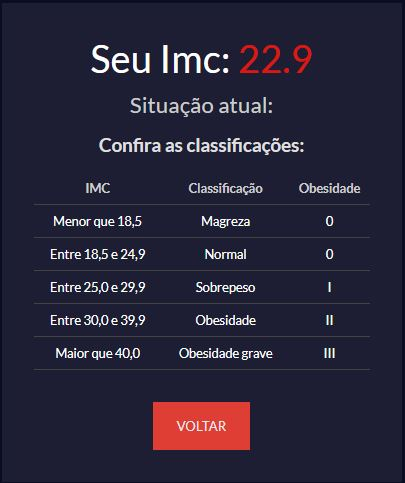
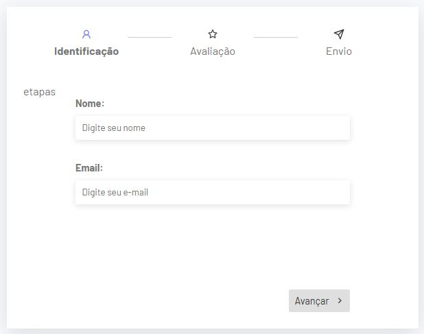

# Curso de React + Vite

O React é uma biblioteca JavaScript de código aberto criada pelo Facebook para construção de interfaces de usuário interativas e dinâmicas, especialmente em aplicações de página única (SPAs). Ele utiliza um conceito chamado Virtual DOM, que otimiza atualizações de interface, garantindo um desempenho superior ao manipular elementos de forma eficiente. Uma das principais funcionalidades do React é o uso de componentes reutilizáveis, que permitem dividir a aplicação em partes menores e independentes, facilitando o desenvolvimento e a manutenção. Além disso, o JSX combina a sintaxe JavaScript com HTML, proporcionando um código mais intuitivo. O estado (state) e as propriedades (props) controlam dados e comportamentos dos componentes, enquanto o hook useEffect lida com efeitos colaterais. O React também oferece suporte a hooks personalizados para lógica reutilizável e gerenciamento de estado global com bibliotecas como Redux ou Context API. Por fim, ele é amplamente utilizado no desenvolvimento de aplicações modernas devido à sua flexibilidade, alta performance e comunidade ativa.

## TECNOLOGIAS UTILIZADAS NO DESENVOLVIMENTO DO PROJETO

1. **Node.js (Express para APIs):**  
   Plataforma de execução de JavaScript no lado do servidor que permite criar aplicações escaláveis e de alta performance. O **Express** é um framework minimalista e flexível para criação de APIs RESTful, facilitando o roteamento, middleware e tratamento de requisições HTTP.  

2. **MongoDB com Mongoose (Database NoSQL):**  
   Banco de dados NoSQL orientado a documentos que armazena dados em formato JSON-like, ideal para aplicações com dados dinâmicos e não estruturados. O **Mongoose** é uma biblioteca de modelagem de objetos (ODM) que facilita a interação com MongoDB, fornecendo validação, esquemas e recursos avançados.  

3. **APIs Externas:**  
   Interfaces que permitem que aplicações se conectem a serviços de terceiros para consumir dados ou executar funcionalidades, como pagamento, geolocalização e autenticação. São acessadas via protocolos HTTP usando métodos como GET, POST, PUT e DELETE.  

4. **JavaScript ES6+:**  
   Versão moderna do JavaScript com recursos avançados, como **arrow functions, destructuring, classes, módulos, template literals e promises**. Essas melhorias tornam o código mais conciso, legível e eficiente.

## PROJETO DESENVOLVIDOS DURANTE O CURSO

## Calculadora IMC

  

 ## Tela de Login

 ## Formulario com vários passos

**Fonte: Hora de Cordar - React do Básico ao Avançado **

 

##  TECNOLOGIAS UTILIZADAS NO DESENVOLVIMENTO DO PROJETO

 

 
